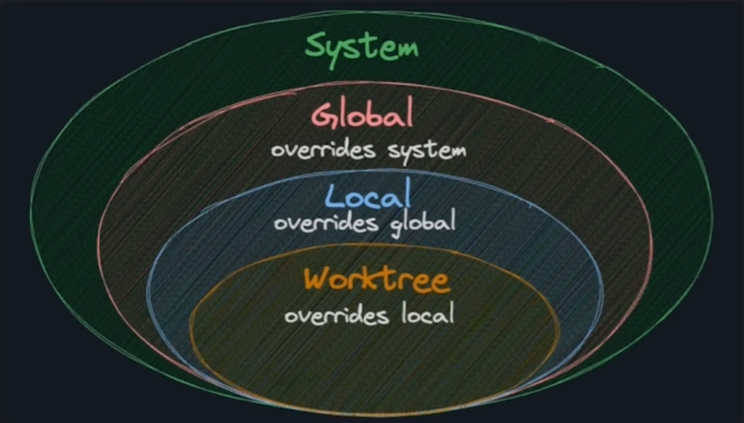
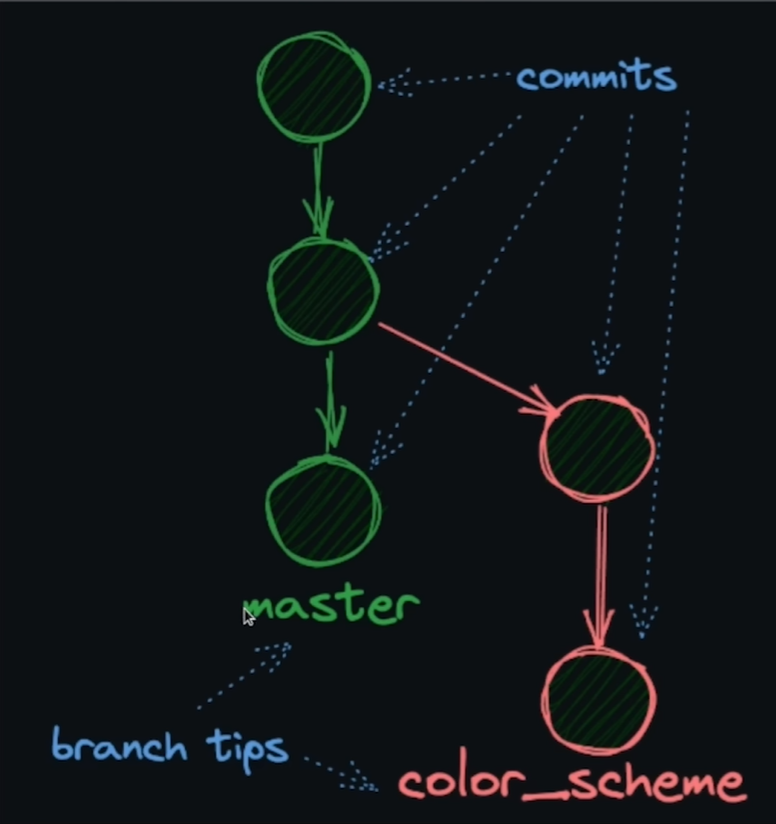

# Git

Git é um sistema de controle de versão, que permite que você rastreie e controle as alterações dos arquivos no seu projeto.

## Repositórios

- ```git init``` -- inicializa um repositório vazio, no diretório atual, ele cria a pasta .git que armazena todos os dados do repositório, commits, branches, histórico e etc.

- ```git status``` -- mostra o status atual de um arquivo, podendo ser untracked, staged ou committed, você pode passar um arquivo ou diretório como argumento para ver o status de um arquivo específico. A resposta retornada pro exemplo: ``git status git.md``

```bash
On branch master

No commits yet

Untracked files:
  (use "git add <file>..." to include in what will be committed)
	git.md

nothing added to commit but untracked files present (use "git add" to track)
```

## Staging Area

O "Staging Area" (ou área de preparação) é um passo intermediário entre o seu diretório de trabalho (onde você edita os arquivos) e o repositório Git (onde os commits são armazenados). Quando você modifica arquivos, o Git não os inclui automaticamente no próximo commit. Primeiro, você deve adicioná-los ao staging area usando o comando `git add`.

 ```git add``` -- adiciona um arquivo ou diretório ao stage, ele marca o arquivo para ser incluído no próximo commit,  você pode passar um arquivo ou diretório como argumento para adicionar um arquivo específico. Você também pode somente passar logo após o comando ```git add``` um ```.``` pra adicionar todos os arquivos não trackeados, arquivos modificados e arquivos deletados. A resposta retornada pro exemplo: ```git status git.md```, após o comando ```git add git.md``` 

```
On branch master

No commits yet

Changes to be committed:
  (use "git rm --cached <file>..." to unstage)
	new file:   git.md

```

### Removendo um arquivo do Staging Area

Se você adicionou um arquivo ao staging area por engano (usando `git add`), mas ainda não fez o commit, você pode removê-lo de lá (fazer o *unstage*) sem perder as modificações que você fez no arquivo em si.

Para remover um arquivo do staging area, você pode usar o comando `git restore`:

```bash
git restore --staged <nome-do-arquivo>
```

*(Nota: O próprio comando `git status` costuma sugerir esse comando quando há arquivos no stage.)*

Isso tira o arquivo da área de preparação, mudando seu status de volta para modificado (ou untracked, se for um arquivo novo), mas **mantém todas as alterações** feitas no seu disco. 

Se você quiser descartar as alterações do arquivo de forma definitiva (apagar o que editou e voltar pro estado do último commit), você remove a flag `--staged` e o comando seria `git restore <nome-do-arquivo>`.

## Commit

- ```git commit -m``` -- um commit é como uma fotografia do seu repositorio, em um determinado ponto no tempo. Git não armazena as diferenças, o git guarda todo histórico por commit. Pra realizar um commit, você deve executar o comando ```git commit -m "mensagem do commit"```. A mensagem retornada é:

```bash
[master (root-commit) 8379dc0] add mod git.md
 1 file changed, 17 insertions(+)
 create mode 100644 git.md
```

logo após o commit, rodando o comando ```git status```

```bash
On branch master
nothing to commit, working tree clean
```


logo após o commit, rodando o comando ```git log --oneline```

```bash
38d407a (HEAD -> master) add mod git.md
8379dc0 add git.md
```

- ```git commit --amend``` -- se você errou a mensagem do seu ultimo commit, você pode corrigir com o comando ```git commit --amend -m "nova mensagem"```

## Git Log

- ```git log``` -- em um projeto provavelmente você vai ter uma longa lista de commits. Pra visualizar esse historico de commits, você pode usar o comando ```git log```, que mostra uma lista de commits com informações como data, autor e mensagem. Você também pode usar o comando ```git log --oneline``` para mostrar apenas a mensagem e o hash do commit.

```bash
commit 33ff827d4c7414a93a9f03e8cd29016cd256bb2f (HEAD -> master)
Author: Leonardo Tavares <leo@gmail.com>
Date:   Tue Jan 20 15:31:02 2026 -0300

    add mod two git.md

commit 38d407a67582cdaeac5fcc7436957e9fc813d72c
Author: Leonardo Tavares <leo@gmail.com>
Date:   Tue Jan 20 15:14:00 2026 -0300

    add mod git.md

commit 8379dc0a3524a934c1cb4483a6ac8406d18d3bd0
Author: Leonardo Tavares <leo@gmail.com>
Date:   Tue Jan 20 15:12:28 2026 -0300

    add git.md
:
```

### Variações:

- ```git --no-pager log -n 10``` -- limita o maximo de commits a serem exibidos, - por exemplo, ```git --no-pager log -n 10``` limita a exibição de 10 commits.

- ```git --no-pager log -n 10 --oneline``` -- mostra apenas a mensagem e o hash do commit com a limitação de 10 commits.

- ```git --no-pager log -n 10 --oneline --graph``` -- mostra apenas a mensagem e o hash do commit com a limitação de 10 commits e um grafico de commits.

- ```git --no-pager log -n 10 --oneline --parents``` -- mostra apenas a mensagem e o hash do commit com a limitação de 10 commits e os pais do commit.

- ```git log -p``` -- **mostra o historico de commits com as mudanças feitas em cada commit.**


## Internals

todos os dados em um repositorio git são armazenados em uma object database, localizada dentro do diretório ```.git```.
Nesse diretório tem um conjunto de arquivos que representam os objetos do Git, como blobs(arquivos), trees(diretorios), commits e tags.

- ```git cat-file -p <hash>``` - permite visualizar o conteudo de um commit diretamente.

### Trees e Blobs:

- tree é a maneira do git armazenar um diretório.
- blob é a maneira do git armazenar um arquivo.

o fluxo pra você ver o conteudo de um arquivo com ``git cat-file`` é:

```bash
git log --oneline
git cat-file -p <hash do tree do commit>
git cat-file -p <hash do blob do arquivo>
```

### Storing Data

Git armazena um snapshot inteiro dos arquivos `per-commit` level. E não somente as mudanças que você fez em cada commit. E sim como que um status do repositorio como um todo no momento do commit. Mas ele não armazena múltiplas cópias do mesmo arquivo se ele não mudou.

- Git comprime e embala(faz um pack dos arquivos) para armazenar esses arquivos de uma forma mais eficiente.
- Se os arquivos não tem mudanças entre os commits, o Git armazena apenas uma cópia do arquivo.

## Git config

Git armazena informações sobre o autor, então quando você faz um commit, o Git pode trackear quem fez aquela mudança ou commit. Para atualizar suas configurações globais do git você pode usar: 
- ```git config --add --global user.name "Seu Nome"```
- ```git config --add --global user.email "Seu Email"```

### Significado das configurações

- ```git config ``` - o comando para interagir com suas configurações do Git.
- ```--add``` - Flag que marca que você quer adicionar uma nova configuração.
- ```--global``` - Flag que marca que você quer adicionar uma nova configuração global no seu diretório ```~/.gitconfig```. Em contrario disso se você utilizar a flag ```local```, as configurações vão ser armazenadas somente no repositório atual.
- ```user``` - a seção
- ```name``` - a chave
- ```email``` - a chave

### List

- Você pode usar o comando ```--list``` - para listar todas as configurações do Git. 
```bash
git config --list
```
- Você também pode adicionar a flag ```--local``` para listar as configurações locais do repositório atual.
```bash
git config --list --local
```

### GET

Você pode usar o comando ```--list``` para ver as configurações de todos os valores, mas a flag ```--get``` é util para ver um valor específico de uma configuração.

- ```--get``` - Flag que retorna o valor de uma configuração específica.
- ```git config --get --local <key>```

Exemplo: ```git config --get --local user.name```

### UNSET

Você pode usar o comando ```--unset``` para remover uma configuração específica.

- ```--unset``` - Flag que remove uma configuração específica.
- ```git config --unset --local <key>```

Exemplo: ```git config --unset --local user.name```

- ```git config --unset-all <key>``` - Flag que remove todas as instâncias de uma key da sua configuração.
- exemplo: ```git config --unset-all <key>```

### Duplicates

Geralmente, em um key/value pair, como [Python Dictionaries](https://www.w3schools.com/python/python_dictionaries.asp), você não pode ter chaves duplicadas. Mas estranhamente o GIT não se importa com isso e permite chaves duplicadas.

Então mesmo se você já tiver uma chave com um valor, você pode adicionar outra chave com o mesmo nome e um valor diferente.

Exemplo:
```bash
git config --add --local user.name "Dev 001"
git config --add --local user.name "001 Dev"
```
A sua saída para ```git config --list --local``` seria algo como:

```bash
core.repositoryformatversion=0
core.filemode=false
core.bare=false
core.logallrefupdates=true
core.ignorecase=true
user.name=001 Dev
user.name=Dev 001
```

Então ele vai sempre pegar o último valor da chave configurada.

### Sections

Uma seção é basicamente um grupo de configurações relacionadas, como [user, core, alias, remote].

Diferentemente de uma key que é uma variável específica, que você pode configurar com um value dentro de uma seção.

```bash
[user]                     <-- Isso é a SECTION (Seção)
    name = Maria Silva     <-- "name" é a KEY (Chave), "Maria Silva" é o Valor
    email = maria@email.com<-- "email" é a KEY (Chave)

[core]                     <-- Isso é outra SECTION
    editor = vim           <-- "editor" é a KEY
```

Você pode remover uma seção inteira da sua configuração usando o comando: 
```bash
git config --remove-section section
```

### Locations

Existem vários lugares onde o Git pode ser configurado, desde o arquivo de configuração global até o arquivo de configuração local do repositório.

- **system**: ```etc\gitconfig```, um arquivo que configura o Git para todos os usuários do sistema.
- **global**: ```~/.gitconfig```, um arquivo qu configura o Git para todos os projetos de um usuários específico 
- **local**: ```.git/config```, um arquivo que configura o Git para um repositório específico.
- **worktree**: ```.git/config.worktree```, um arquivo que configura o Git para uma parte de um projeto.

Provavelmente em 90% do tempo você deva usar o arquivo de configuração global(```--global```) para configurar suas preferências pessoais como nome e email, e 9% para o arquivo de configuração local(```--local```) para configurar suas preferências de repositório na maioria do tempo. 1% para o arquivo de configuração worktree(```--worktree```), mas é bem raro.

Se você configurar um arquivo numa location específica, essa configuração vai substituir a configuração de uma location geral. Por exemplo, se você configurar ```user.name``` na configuração local, ele vai substituir o ```user.name``` na configuração global. Ou seja quanto mais específico, mais ele substitui a configuração geral anterior.



## HEAD

No Git, o `HEAD` é um ponteiro especial que indica qual é o commit atual no seu diretório de trabalho. Você pode pensar nele como a sua "posição atual" ou "onde você está agora" no histórico do repositório.

Em situações normais, o `HEAD` aponta para a branch local em que você fez checkout (por exemplo, `main` ou `master`). Esta branch, por sua vez, aponta para o commit mais recente feito nela.

### Detached HEAD (HEAD Desanexado)

Se você usar o comando de alternância diretamente para um commit específico (usando o hash desse commit) em vez de usar o nome de uma branch, você entrará em um estado conhecido como **Detached HEAD**.

```bash
# Alternando diretamente para um commit
git switch --detach 33ff827
# Ou no método clássico:
git checkout 33ff827
```

Nesse estado de "HEAD desanexado", o `HEAD` aponta diretamente para um commit específico e não para uma branch. Qualquer novo commit que você fizer a partir daqui não pertencerá a nenhuma branch visível e poderá ser perdido (apagado pelo "garbage collector" do Git) futuramente quando você mudar para outra branch ativa.

Caso você faça modificações nesse estado e deseje salvá-las, precisará criar uma nova branch apontando para o seu `HEAD` atual:

```bash
git switch -c nome-da-nova-branch
```

## Branches

Uma branch no git te permite manter o track de diferentes mudanças no seu projeto separadamente.

Por exemplo, vamos dizer que você tem um grande projeto, no qual você quer experimentar uma nova paleta de cores. Em vez de mudar o projeto inteiro diretamente, você pode criar uma nova branch chamada ```nova-paleta``` e fazer as alterações lá.  Isso permite que você teste a nova paleta sem afetar o código principal do projeto. Quando você terminar, se estiver satisfeito com as mudanças, você pode mesclar (```merge```) a branch ```nova-paleta``` com a branch principal do projeto. Se você não estiver satisfeito, você pode simplesmente descartar a branch ```nova-paleta``` e continuar trabalhando na branch principal.

### O que é uma branch?

Na tradução literal, branch significa "ramo". No desenvolvimento de software ela tem o mesmo significado, branch é uma ramificação(ramo) do seu projeto.

Uma branch nada mais é, que um ponteiro nomeado para um commit específico. Quando você cria uma branch, você está criando um novo ponteiro para um commit específico.

Devido a branch ser só um ponteiro de um commit, criar uma nova branch é algo que não tem um custo elevado em performace, pelo contrário, elas são "leves" e "baratas". Quando você cria 10 branches, você não está criando 10 copias do seu projeto no disco do seu computador, apenas um ponteiros para um commit específico.

```branch tips``` - é o último commit de uma branch, ou seja o ponto mais recente no qual você estava trabalhando.



### Trabalhando com branches

- Default branch

A branch padrão é a branch que é criada quando você inicializa um repositório com ```git init```. Ela é chamada de ```main``` ou ```master```. Se você estiver trabalhando com github, é recomendado usar ```main``` como branch padrão.

- Checando a branch atual

Para checar qual a sua branch atual, você pode usar o comando ```git branch``` sem nenhum argumento. Isso mostrará todas as branches existentes no seu repositório local, com a branch atual marcada com um asterisco.

```bash
git branch
```
- Criando uma nova branch

Para criar uma nova branch, você pode usar o comando ```git branch``` seguido do nome da branch que você deseja criar. Por exemplo:

```bash
git branch nova-branch
```

Isso criará uma nova branch chamada ```nova-branch``` que aponta para o mesmo commit que a branch atual.

**Se você quiser criar uma branch e ir diretamente pra ela, você pode simplismente usar o comando:**

```bash
git switch -c nova-branch
```

Quando você cria uma nova branch, ela usa o commit atual como ponto de partida. Por exemplo, se você estiver na branch ```main``` e tiver commits ```A```, ```B``` e ```C```, e você criar uma nova branch ```nova-branch```, ela apontará para o commit ```C```.

Exemplo de como sua branch deve ficar:

```
A - B - C
         \
          nova-branch
```

- Alternando para uma branch existente

Para alternar para uma branch existente, você pode usar o comando ```git switch``` seguido do nome da branch que você deseja alternar. Por exemplo:

```bash
git switch nova-branch
```

Isso alternará para a branch ```nova-branch``` e atualizará seu diretório de trabalho para refletir as mudanças nessa branch.

- Excluindo uma branch

Para excluir uma branch, você pode usar o comando ```git branch -d``` seguido do nome da branch que você deseja excluir. Por exemplo:

```bash
git branch -d nova-branch
```

Isso excluirá a branch ```nova-branch``` do seu repositório local.

- Renomeando uma branch

Para renomear uma branch, você pode usar o comando ```git branch -m``` seguido do nome antigo e do novo nome da branch. Por exemplo:

```bash
git branch -m nome-antigo-branch novo-nome-branch
```

Isso renomeará a branch ```nova-branch``` para ```branch-renomeada```.

### Visualizando branches

O git tem a sua forma de visualizar branches por meio de texto. Por exemplo:

```bash
A - B - C  main
```

Isso significa que o commit ```C``` é o último commit na branch ```main```, e os commits ```A``` e ```B``` são seus commits anteriores.

Para representar multiplas branches, o git usa uma notação de linha de tempo. Por exemplo:

```bash
A - B - C  main
     \
      D - E  feature
```

Isso significa que a branch ```feature``` foi criada a partir da branch ```main```, tendo como ponteiro o commit ```B```, e tem dois commits adicionais ```D``` e ```E```.

- Git Files

Lembrando que o Git guarda todas as informações do seu projeto, incluindo branches, commits e arquivos, no subdiretório ```.git``` no root do seu projeto. Os "heads" das branches são armazenados no diretório ```.git/refs/heads/```. Se você acessar um desses arquivos, você verá o hash do commit que é o ponteiro da branch.

## Merge

Quando você está trabalhando em uma branch, seja uma nova feature, a correção de um bug ou qualquer outro tipo de coisa, em algum momento se estiver satisfeito com o resultado, você provavelmente vai querer mesclar (merge) essa branch com a branch principal (geralmente ```main``` ou ```master```). O merge é o processo de unir as alterações de uma branch com outra.

Então vamos dizer que você está em um estado que você tem duas branches, cada uma com commits únicos.

```bash
A - B - C - main
     \
      D - E  feature
```

Se você mergear a branch ```feature``` com a branch ```main```, o Git combina as duas branches, criando um novo commit que tem o histórico das duas branches, no diagrama ```F``` é um ````merge commit````, que tem ```C``` e ```E``` como parentes. O commit ```F``` traz todas as mudanças dos commits ```D``` e ```E``` para a branch ```main```:

```bash
A - B - C - F main
     \     /
      D - E  feature
```

### Merge Commits

Quando estamos mergeando duas branches com históricos divergentes, assim como no exemplo abaixo

```bash
A - B - C - main
     \
      D - E  feature
```

o Git cria um merge commit que é o único com dois parentes. 
- **1** - Primeiro é necessário encontrar o ```merge base``` aka ```best common ancestor```, é o ancestral mais recente que as duas branches tem em comum no exemplo acima é o commit ```B```. 
- **2** - Em seguida o Git coloca os commits da branch ```main``` no ```merge commit```, e após isso os commits da branch ```feature``` são adicionados. 
- **3** - Quando todas as mudanças são incorporadas, o merge commit é criado e colocado na branch ```main```. Nesse caso seria o commit ```F```. Ele tem dois parentes apontando para os commits ```C``` e ```E```.

```bash
A - B - C - F main
     \     /
      D - E  feature
```

Para mergear a branch  ```feature``` com a branch ```main```, você pode usar o comando ```git merge```:

```bash
git merge feature
```

### Merge Log

Se você quiser visualizar o log de um merge commit, de forma mais detalhada, você pode utilizar o comando ```git log```, e usar os parâmetros ```--oneline --graph --decorate --parents```:

- ```--oneline``` - retorna uma visão condensada do histórico de commits, os hashes dos commits são abreviados para 7 caracteres, que é a quantia mínima que o git requer para especificar um hash.
- ```--graph``` - desenha todas as linhas do grafo de commits, mostrando como os commits divergiram, e retornaram a linha principal por meio de um merge commit.
- ```--decorate``` - mostra rótulos de branches e tags
- ```--parents``` - mostra os parentes de cada commit

```bash
git log --oneline --graph --decorate --parents
```

### Fast Forward Merge

O tipo mais simples de merge é o "fast forward merge".

Vamos dizer que você vai adicionar uma feature no projeto:

```bash
A - B - main
     \    
      C -  feature
```

E você rodar o comando:

```bash
git merge feature
```

Por causa que a branch `feature` tem todos os commits que a branch `main` tem, o Git pode simplesmente avançar a branch `main` para o commit mais recente da branch `feature`, sem criar um merge commit. Isso é chamado de "fast forward merge".

Ele automaticamente faz um ```fast forward merge```. Ele simplismente move o ponteiro da base da branch `main` para o commit mais recente da branch `feature`.

Quando o merge é feito em uma branch que está atualizada com a branch de destino, o Git pode simplesmente avançar a branch para o commit mais recente da branch de destino, sem criar um merge commit. Isso é chamado de "fast forward merge".

Então o diagrama final seria:

```bash
A - B - C - main
```

Porque o Git fez um fast forward merge, ele não criou um merge commit.

## Rebase

O rebase é uma operação do git que te permite reaplicar os commits de uma branch, para o ```tip```, ou a ponta da branch de destino. Diferente do ``merge``, o rebase não cria um merge commit. Então o histórico da branch de destino fica mais linear, justamente porque ele não adiciona uma nova camada de commits, ele simplesmente "reescreve" o histórico  de commits. O histórico ficaria parecido com isso:

Antes:

```bash
A - B - C - main
     \    
      D - E  feature
```

Depois de rodar `git rebase main` na branch `feature`:

```bash
A - B - C - main
          \ - D' - E'  feature
```

Nesse processo o git:
- 1 - encontra o ponto em comum entre as duas branches(merge base)
- 2 - pega os commits da branch atual
- 3 - move temporariamente o ponteiro
- 4 - reaplica esses commits para o topo da branch de destino

Uma vantagem do merge é que ele preserva o histórico verdadeiro do projeto. Ele mostra quando, onde e como as branches foram mergeadas. Uma desvantagem é que isso cria uma grande quantidade de commits, o que pode tornar o histórico mais difícil de ler e entender.

Um histórico linear geralmente é mais facil de ler, entender e trabalhar com.

## Reset

Um dos grandes benefícios do git é a capacidade de desfazer ações.  O comando ```git reset``` é uma das ferramentas mais poderosas para isso. Ele pode ser usado para desfazer o último commit ou qualquer mudança, seja ela no staging area ou no working directory.

### Git Reset Soft

A opção ``--soft``, é útil quando você quer desfazer seu último commit, mas ainda manter todas as mudanças que você fez no staging area. Mudanças que foram commitadas vão ser desfeitas e colocadas no staging area, enquando mudanças que ainda não foram commitadas, vão permanecer como staged ou unstaged.

```bash
git reset --soft HEAD~1
```

- HEAD~1 é uma referência do commit anterior ao commit atual.

Então você desfaz as mudanças, enquanto ainda as mantém disponíveis para serem commitadas novamente.

### Git Reset Hard

Diferente do ``--soft``, o ``--hard`` desfaz as mudanças dos commits, e remove as mudanças do staging area e do working directory que você tem. Então é como se você nunca tivesse feito as mudanças. Ele só não aplica o reset se em arquivos que não estão trackeados na worktree.

Então é útil se você simplismente quiser voltar pra um commit anterior e descartar todas as mudanças que você fez desde então. Ele vai limpar seu index e também seu worktree.

```bash
git reset --hard HEAD~1
```

ou

```bash
git reset <hash do commit>
```

``git reset --hard`` é um comando poderoso, mas também **perigoso** pois ele vai apagar todas as mudanças que você fez desde o commit que você está resetando, inclusive as que não foram commitadas ainda, fora os arquivos que não estão trackeados na worktree. Então é bom tomar cuidado e ter certeza que você quer fazer isso.

## Remote

Quando você está trabalhando em um projeto, é comum que você queira compartilhar seu trabalho com outras pessoas. Para isso, você pode usar o git remote. O git remote é uma ferramenta que permite que você gerencie as conexões entre o seu repositório local e os repositórios remotos. Eles são repositórios externos com o mesmo histórico do git do seu repositório local.
Esses repositórios não necessariamente precisam estar hospedados em um Github da vida, pode ser um repositório local, ou em um servidor próprio por exemplo.


### Adicionando um Remote

Quando adicinamos um remote, e tratamos ele como "a fonte da verdade", ele é chamado de **origin**.

Como "fonte da verdade", isso quer dizer que você e o seu time vão tratar ele como o repositório verdadeiro ou principal. É onde tem a maioria do código final e aceito pelo time.

Para adicionar um remote, você pode usar o comando ```git remote add```:

```bash
git remote add origin <uri>
```

OBS: se você adicionar a opção ``-u``, você vai estar dizendo para o git que você quer que essa branch seja rastreada pela branch remota. Ou seja, quando você rodar ``git pull`` ou ``git push``, o git vai saber qual branch remota ele deve usar. E você não vai precisar mais digitar ``git pull origin main`` ou ``git pull origin master``, basta digitar ``git pull`` ou ``git push``.

```bash
git remote add -u origin <uri>
```

### Fetch

Adicionar um repositório remoto é uma coisa, mas o que acontece se esse repositório remoto for atualizado? Você precisa atualizar o seu repositório local com as mudanças do repositório remoto. Para isso, você pode usar o comando ```git fetch```:

```bash
git fetch origin
```

Esse comando vai baixar todas as mudanças do repositório remoto de ```.git//objects``, mas não vai aplicar nenhuma mudança no seu repositório local. Ele só vai atualizar os ponteiros das branches remotas.

### Log Remote

O comando ``git log`` pode ser usado também pra mostrar o histórico de commits de um repositório remoto também. Por exemplo:

```bash
git log remote/branch
```

Por exemplo se você quiser ver os commits de uma branch chamada feat/login, você pode usar o comando:

```bash
git log origin/feat/login
```

### Merge

Assim como nós podemos mergear branches locais, nós também podemos mergear branches locais com branches remotas. Por exemplo:

```bash
git merge remote/branch
```

Mais uma vez com o exemplo da branch ```feat/login```:

```bash
git merge origin/feat/login
```

## Github

Enquanto o **Git** é a ferramenta (o motor) que gerencia as versões do seu código localmente, o **GitHub** é uma plataforma de hospedagem de código na nuvem construída em cima do Git. Ele permite que você armazene seus repositórios Git online, colabore com outros desenvolvedores, faça backup dos seus projetos e compartilhe seu código (de forma pública ou privada). 
Em resumo: o Git é o sistema de controle de versão, e o GitHub é o serviço onde você hospeda seus repositórios Git.

### Pull

Quando fazemos o fetch, nós baixamos as mudanças do repositório remoto, mas não aplicamos nenhuma mudança no nosso repositório local. Para aplicar as mudanças no nosso repositório local, nós precisamos usar o comando ```git pull```:

```bash
git pull origin
```

### Pull Requests

No github, uma pull request é uma solicitação de merge de uma branch para outra. Ou seja, você está pedindo para que as mudanças que você fez na sua branch sejam mergeadas na branch de destino.

É muito comum você criar uma branch, fazer as mudanças que você quer, e depois criar uma pull request para que o seu time possa revisar as mudanças e aprovar o merge. Elas permitem que o seu time possa discutir sobre as mudanças, sugerir melhorias, e garantir que as mudanças sejam feitas da melhor forma possível.

## Gitignore

É muito comum ter um workflow parecido como esse em um projeto:

```
git add .
```
```
git push origin main
```
```
git commit -m "alguma mensagem aqui"
```

Mas um problema aparece quando nós queremos colocar arquivos no diretório do seu projeto, mas não queremos que eles sejam rastreados ou trackeados pelo Git. O ``.gitignore`` resolve esse problema. Um exemplo é se você trabalha com Javascript, você provavelmente vai querer ignorar o diretório dos ``node_modules``. O ``.gitignore`` pode ignorar arquivos e diretórios. 
 
Se você adicionar no arquivo ``.gitignore`` o nome do diretório ``node_modules``, o Git vai ignorar:

- ``node_modules/code.js``
- ``src/node_modules/code.js``
- ``src/node_modules``

mas ele não iria ignorar algo como:

- ``src/node_modules_2/code.js``
- ``src/node_modules_4``

### Nested Gitignore

O seu ``.gitignore`` não necessariamente precisa estar no root do seu projeto. Ele pode estar em qualquer diretório do seu projeto. E ele vai ignorar todos os arquivos e diretórios que estiverem abaixo dele ou no caso os subdiretórios.

por exemplo:

```
src/
|--assets/
|    |--images/
|    |--styles/
|    |--.gitignore
|--node_modules/
|--.gitignore
```
Nesse caso o ``.gitignore`` na pasta ``src/assets`` vai ignorar todos os arquivos e diretórios que estiverem abaixo dele. o mesmo se aplica ao ``.gitignore`` na pasta ``src``.

### Patterns

Os arquivos ``.gitignore`` aceitam patterns, que são como "padrões" de arquivos e diretórios que devem ser ignorados. Por exemplo, se você quiser ignorar todos os arquivos com a extensão ``.log``, você pode adicionar no arquivo ``.gitignore``:

```
*.log
```

Isso vai ignorar todos os arquivos com a extensão ``.log``, como:

- ``file.log``
- ``src/file.log``
- ``src/node_modules/file.log``


#### Wildcards

O caracter ``*`` trigga qualquer quantidade de caracteres, exceto o separador ``/`` . Por exemplo se você quiser ignorar todos os arquivos com ``.txt``, você pode usar o pattern:

```
*.txt
```

#### Rooted Patterns

Patterns que começam com ``/`` são ancorados ao diretório onde o ``.gitignore`` está localizado. Por exemplo, se você quiser ignorar um arquivo chamado ```root.js`` no diretório root do projeto, mas não nos subdiretórios:

```
/root.js
```

#### Negation

Você pode negar um pattern prefixando ele com ``!``. Por exemplo se você quiser ignorar todos os arquivos com ``.txt``, mas não quiser ignorar o arquivo ``root.txt``:

#### Comentários

Os comentários no ``.gitignore`` começam com ``#``.

```
# Ignora todos os arquivos com .txt
*.txt

# Mas não ignora o arquivo root.txt
!root.txt
```

### O que Ignorar?

Vimos como nós podemos ignorar arquivos, mas o que exatamante você deve ignorar? Algumas regras que você pode seguir nos seus projetos são

- 1 - Ignore coisas que possam ser geradas(exemplo: código compilado, arquivos mimificados, etc.)
- 2 - Ignore dependências(exemplo: ``node_modules``, ``venv``, ``packages``, etc.)
- 3 - Ignore coisas que são pessoais ou da forma como você gosta de trabalhar(exemplo: configurações do seu editor)
- 4 - Ignore coisas que pode ser sensíveis ou perigosas(exemplo: arquivos ``.env``, senhas, chaves de API, etc.)

## Fork

Um **fork** é uma cópia de um repositório que fica na sua conta. Diferente de um clone (que é uma cópia local), o fork reside no servidor do provedor de hospedagem (como o GitHub).

### Para que serve?
- **Contribuir para projetos Open Source:** Você faz um fork, altera o código no seu repositório e depois envia um *Pull Request* para o projeto original.
- **Base para novos projetos:** Usar um projeto existente como ponto de partida para algo novo.
- **Experimentação:** Testar mudanças sem risco de afetar o repositório principal.

### Sincronizando um Fork
Para manter seu fork atualizado com o repositório original (upstream):

1. Adicione o repositório original como um remote:
   ```bash
   git remote add upstream https://github.com/usuario-original/repositorio.git
   ```
2. Busque as alterações:
   ```bash
   git fetch upstream
   ```
3. Faça o merge no seu branch principal:
   ```bash
   git merge upstream/main
   ```

## Git Reflog

O comando ``git reflog`` é parecido com o comando ``git log``, mas como o nome diz, (ref-log ou reference log - registro de referência) ele registra especificamente as mudanças nas **referências** que aconteceram ao longo do tempo.

Ele usa um formato diferente para mostrar o histórico de uma branch ou HEAD, mais focado na quantidade de passos e quais foram esses passos voltando no tempo.

Exemplo:

```bash
953e35f (HEAD -> main, origin/main) HEAD@{0}: commit: Explicação sobre Git Fork
5794c23 HEAD@{1}: commit: Configurando o arquivo .gitignore
48a5e1c HEAD@{2}: commit: Exemplos de patterns no Gitignore
dd40822 HEAD@{3}: commit: Início da documentação de Gitignore
793c68a HEAD@{4}: pull: Merge made by the 'ort' strategy.
b43a7eb HEAD@{5}: commit: Seção de Git Pull e GitHub
3c43bf7 HEAD@{6}: Branch: renamed refs/heads/master to refs/heads/main
3c43bf7 HEAD@{8}: commit: Documentando comandos de Remote
e48f394 HEAD@{9}: commit: Explicando Reset Soft e Hard
4ee31e6 HEAD@{10}: commit: Início da seção de Reset
376a4f1 HEAD@{11}: reset: moving to HEAD~1
```

Então ele mostra todo o histórico de movimentos que você fez nas referências locais(como HEAD), o que te permite até recuperar estados passados que não aparecem no ``git log``.

### Usando Reflog com Merge e Commit-ish

O Reflog não serve apenas para visualização. As entradas que você vê (como `HEAD@{n}`) são tipos de **commit-ish** (referências que apontam para um commit específico). Você pode usar essas referências diretamente em comandos como `merge`.

#### Exemplo: Recuperando um Merge Deletado

Imagine que você deletou uma branch após um merge, mas depois percebeu que precisava de um estado anterior daquela branch que não está mais no histórico do `git log`.

1.  **Encontre a referência no Reflog:**
    ```bash
    git reflog
    # Resultado:
    # abc1234 HEAD@{0}: merge feature-x: Merge made by the 'ort' strategy.
    # def5678 HEAD@{1}: checkout: moving from feature-x to main
    # 9876543 HEAD@{2}: commit: Finalizando feature-x antes do merge
    ```

2.  **Mergear um estado específico via Reflog:**
    Se você quiser "refazer" o merge ou trazer as alterações exatamente como elas estavam no commit `9876543` (que era o `HEAD@{2}` naquele momento):
    ```bash
    git merge HEAD@{2}
    ```

#### O que é Commit-ish?
Um **commit-ish** é qualquer termo que o Git consiga resolver para um ID de commit. Exemplos comuns:
- Hash completo: `1a2b3c4d...`
- Hash curto: `1a2b3c4`
- Nome de branch: `main`, `feature-login`
- Tags: `v1.0.2`
- Referências relativas: `HEAD~1` (um commit atrás), `main^^` (dois commits atrás)
- **Entradas do Reflog:** `HEAD@{5}`, `main@{yesterday}`

Isso torna o `git merge` extremamente flexível, permitindo que você combine estados temporários ou passados de forma cirúrgica.

### Merge Conflicts

Quando você está trabalhando em arquivos ou linhas diferentes que o seu time, provavelmente você não vai ter conflitos, mas quando você está trabalhando em uma features nas mesmas linhas de código ou no mesmo arquivo que alguém do seu time também está, aí surgem os conflitos.

Um merge conflict ocorre quando dois commits, modificam a mesma linha e o Git não pode automaticamente decidir qual das duas mudanças ele vai manter, e qual ele vai descartar.

Vamos dizer que você tem o seguinte histórico:

```bash
    C - feature
  /
A - B - main
```

A branch ``main`` tem um arquivo com a seguinte função:

```bash
function square(numero) {
  return numero * numero;
}
```

E na feature o mesmo arquivo e função:

```bash
function square(numero) {
  return numero + numero;
}
```

Mas note que o retorno da função da feature é diferente.

Se nós mergearmos a branch ``feature`` na branch ``main``, o Git vai detectar que a linha com o``return`` da função mudou nas duas branches de forma independente, o que acaba criando conflito.

Quando um conflito acontece(geralmente como resultado de um ``merge`` ou um ``rebase``) o Git vai te deixar decidir de forma manual, qual das alterações que você vai manter. E tudo vai bem quando a mesma linha é modificada em um commit, e de novo em outro commit. Mas o problema aparece quando a mesma linha é modificado em dois commits que não tem relação ``pai -> filho``.

### Abortando um merge

Se você quiser abortar o merge você pode usar o comando

```bash
git merge --abort
```

### Lidando com conflitos

Resolver conflitos é um processo manual, quando eles ocorrem o Git marca os arquivos e linhas conflitantes, e você deve resolver esses conflitos.

No arquivo onde ocorreu o conflito, você deve encontrar algo assim:

```bash
<<<<<<< HEAD
jogos do mês: nier automata, ace combat 7, watch dogs
=======
Jogos do mês: ace combat 7, nier automata, watch dogs
>>>>>>> edit-titles
```

``HEAD`` é a branch atual em que você está

``edit-titles`` é a branch de onde vem as mudanças que vem da branch que está sendo mergeada.

``=======`` esse trecho separa as versões do código das duas branches.

Você pode manter as duas alterações se você quiser, mas geralmente você vai querer deixar só uma alteração e descartar a outra.

### Resolução

Terminando de resolver os conflitos, você precisa adicionar e commitar essas mudanças, isso diz ao Git que o conflito foi resolvido e pode continuar com o merge.

### Resolvendo conflitos com Checkout

Em situações onde você deseja aceitar integralmente a versão de uma das branches sem precisar editar o arquivo manualmente, o Git oferece as flags `--ours` e `--theirs` através do comando `git checkout`:

- `git checkout --ours <nome-do-arquivo>` -- resolve o conflito mantendo as alterações da sua branch atual (a branch onde você está).
- `git checkout --theirs <nome-do-arquivo>` -- resolve o conflito mantendo as alterações da branch que está sendo trazida (a branch que você está tentando mergear).

Após utilizar um desses comandos, o arquivo sairá do estado de conflito com o conteúdo da branch escolhida, mas você ainda precisará executar o `git add <nome-do-arquivo>` para marcar a resolução e seguir com o processo de commit do merge.

### Resolvendo Conflitos com Rebase

O rebase funciona de uma maneira distinta do merge, e isso reflete na forma como os conflitos são apresentados. Quando você inicia um rebase (por exemplo, rodando `git rebase main` dentro da branch `feature`):

1.  O Git muda temporariamente o contexto para a branch **target** (`main`).
2.  Ele identifica o ponto comum entre as duas branches.
3.  Ele "desempilha" os commits da sua branch **source** (`feature`) e começa a reaplicá-los, um a um, no topo da branch target.

#### Ours vs Theirs no Rebase

Diferente do merge convencional, no contexto de um rebase os papéis se invertem, o que costuma causar confusão:
-   **`--ours`**: Representa a branch de destino (target), como a `main`. Isso acontece porque o `HEAD` do Git, durante o rebase, é movido para a branch target para que ela sirva de base para os novos commits que serão aplicados.
-   **`--theirs`**: Representa a sua branch de origem (source), cujos commits estão sendo "re-comitados" por cima da nova base.

Se houver um conflito, você deve resolvê-lo manualmente, usar o `git add <arquivo>` para marcar a resolução e, em vez de gerar um novo commit, continuar com:
```bash
git rebase --continue
```

### Git rerere

O comando **rerere** (**Re**use **Re**corded **Re**solution) é uma funcionalidade que permite ao Git "lembrar" como você resolveu um conflito anteriormente.

**Por que ele é útil?**
Em processos de rebase longos, um mesmo conflito pode aparecer repetidas vezes à medida que o Git tenta aplicar vários commits sequenciais que tocam na mesma linha de código. Sem o `rerere`, você teria que resolver o mesmo conflito manualmente em cada commit do rebase.

Com o `rerere` ativado, o Git grava uma "assinatura" do conflito e a forma como você o resolveu. Se o mesmo conflito surgir novamente no futuro, o Git aplica a solução gravada de forma automática, economizando tempo e evitando erros humanos repetitivos.

Para habilitar essa funcionalidade globalmente:
```bash
git config --global rerere.enabled true
```

## Desfazendo uma Resolução Acidental no Rebase

Se durante um rebase você resolver um conflito de forma incorreta e o commit for gerado (ao prosseguir com o rebase), você pode desfazer essa resolução específica para corrigir ela, sem precisar cancelar todo o processo.

Para voltar um passo e re-resolver o conflito do commit atual:

```bash
git reset soft HEAD~1
```

Esse comando remove o último commit aplicado pelo rebase, mas mantém as alterações nos arquivos. Isso permite que você edite o código novamente, aplique a correção adequada, use o `git add` e então continue o fluxo com `git rebase --continue`.

## Squash

Cada time vai ter padrões e opiniões diferentes sobre como usar Git.
Alguns exigem que todos os pull requests tenham um único commit, enquanto outras preferem ver uma série de commits pequenos e focados.

Se você entrar ou estiver em uma equipe que prefere um único commit, vai precisar saber como "squashar" ou "esmagar" seus commits juntos. E mesmo que você não precise de um único commit, o squash é útil para manter o histórico de commits limpo. Como também se você estiver trabalhando em uma feature que tenha um risco ou que possa ser perigosa, e você separou ela em 12 commits, se der algum problema você precisaria resetar esses 12 commits, se você tiver um squash deles, você só reseta um único commit.

### O que é Squashing?

É exatamente o que parece. Nós pegamos todas as mudanças de uma sequência de commits e as comprimimos em um único commit.

### Fazendo Squash com Rebase Interativo

A forma mais comum de realizar o squash é utilizando o **Rebase Interativo**. O `rebase` permite essa operação porque ele foi desenhado para reescrever o histórico de commits. Ao usar a flag interativa (`-i`), o Git pausa o processo de aplicação dos commits e permite que você edite a lista, mude mensagens ou agrupe vários commits em um só antes de aplicá-los definitivamente no topo da branch.

#### Como aplicar o Squash:

1.  **Inicie o rebase interativo:**
    Determine quantos commits você quer agrupar a partir do seu estado atual (`HEAD`). Para os últimos 3 commits, por exemplo, use:
    ```bash
    git rebase -i HEAD~3
    ```

2.  **Escolha a ação Squash:**
    Um editor de texto abrirá listando os commits (do mais antigo para o mais novo). Cada linha começa com a palavra `pick`.
    -   Mantenha a palavra `pick` no primeiro commit da lista (o mais antigo).
    -   Substitua a palavra `pick` por `squash` (ou apenas `s`) nos commits abaixo dele que você deseja mesclar.

    ```text
    pick a1b2c3d commit inicial da feature
    squash e5f6g7h ajuste de interface
    squash i9j0k1l correção de erro ortográfico
    ```

3.  **Edite a mensagem final:**
    Ao salvar e fechar o editor, o Git iniciará o processo de fusão e abrirá um novo editor para você configurar a mensagem do commit único resultante. Você pode combinar as mensagens anteriores ou escrever uma mensagem nova e mais limpa.

Após salvar, o histórico do seu repositório terá apenas um único commit contendo todas as alterações que antes estavam espalhadas, tornando o log muito mais fácil de ler.

### Cuidado: Reescrita de Histórico e Repositórios Remotos

É fundamental entender que operações como `squash`, `amend` ou `rebase` **reescrevem o histórico** de commits. Como o Git identifica cada commit através de um hash único (baseado em seu conteúdo, data e pai), ao alterar ou agrupar commits já existentes, novos hashes são gerados, invalidando os antigos.

#### Desincronização com o Remote

Se você já tiver enviado (*push*) os commits originais para um repositório remoto antes de realizar o squash localmente, o seu repositório local e o remoto ficarão desincronizados. O servidor ainda terá a sequência de commits originais, enquanto o seu computador terá um novo commit resultante da fusão, com um hash completamente diferente.

Ao tentar rodar um `git push` comum após o squash, o Git rejeitará a operação. Ele entenderá que a sua branch local e a branch remota divergiram e impedirá o envio para evitar a perda acidental de histórico no servidor.

#### O uso do Force Push

Para sincronizar o repositório remoto com o seu novo histórico reescrito, você precisará forçar a atualização utilizando a flag `--force`:

```bash
git push origin <nome-da-branch> --force
```

O **force push** substitui obrigatoriamente o histórico do servidor pelo histórico da sua máquina local, descartando os commits antigos que existiam lá.

**Cuidado:** Esta é uma operação considerada "destrutiva". Se outros desenvolvedores estiverem trabalhando na mesma branch e já tiverem baixado os commits antigos, o `force push` quebrará o fluxo de trabalho deles, pois o histórico em que eles se basearam deixará de existir no servidor. A regra de ouro é: **evite reescrever o histórico e usar force push em branches compartilhadas (como `main` ou `develop`)**. Utilize essas técnicas preferencialmente em suas branches de funcionalidade (*feature branches*) antes de realizar o merge final.

## Stash

Já deve ter acontecido alguma vez com você, se você trabalha em equipe, quando você está resolvendo um bug ou então trabalhando em uma feature em uma branch, mas aí aparece algo urgente que você precisa resolver em uma nova branch. Só que você ainda não terminou com as mudanças que você está trabalhando no momento, elas ainda estão em desenvolvimento, e você não quer perder todo o seu trabalho.

Se você não souber o que o stash faz, pra salvar seu trabalho, você talvez criasse um outro clone do seu repositório, mas talvez essa não seja uma boa idéia.

### Git Stash

O comando ``git stash`` grava o estado atual do seu diretório de trabalho, e o index(staging area). É como o copia e cola do deu computador. Ele grava essas mudanças em um lugar seguro e reverte o diretóro de trabalho pra combinar com o seu ``HEAD`` commit(o último commit da sua branch atual).

Para colocar suas alterações em stash e reverter seu working directory ou seu diretório de trabalho para combinar com seu ``HEAD`` use:

```bash
git stash
```

usando esse comando você teria um retorno mais ou menos assim:

```bash
Saved working directory and index state WIP on main: 2677ff2 git stash
```

uma vez que você colocou suas alteações em stash, se certifique que elas estão seguras listando o seu stash atual, para listar seus stashes use:

```bash
git stash list
```

rodando ``git stash list`` com o argumento ``-p`` ele retorna as linhas que estão incluídas em cada stash.

retorno de exemplo:

```bash
git stash list -p
stash@{0}: WIP on main: 2677ff2 git stash

diff --git a/titles.md b/titles.md
index f5f2053..8803af7 100644
--- a/titles.md
+++ b/titles.md
@@ -3,4 +3,5 @@ new title
 new line master
 some text here to commit
 jogos do mês: nier automata, ace combat 7, watch dogs
-melhores jogos do mês: routine, enter the gungeon, rise of the tomb raider
\ No newline at end of file
+melhores jogos do mês: routine, enter the gungeon, rise of the tomb raider
+melhores lançamentos do ano: pragamta, resident evil requiem, mouse p.i for hire
\ No newline at end of file
```

### Pop

Stash tem algumas opções, as que você provavelmente mais vai usar são:

```bash
git stash

git stash pop

git stash list
```

O comando ``pop`` funciona seguindo a lógica de uma **pilha (stack)**: ele sempre pega o stash mais recente (o `stash@{0}`) para aplicar ao seu working directory e o remove da lista. Por causa desse comportamento de "último a entrar, primeiro a sair", o ideal é evitar acumular muitos stashes para não perder o controle do que está em cada um; manter a pilha curta (ou até apenas um por vez) torna o uso do ``pop`` muito mais simples e intuitivo.

Rodando ``git stash pop``, você deve ter um retorno mais ou menos assim:

```bash
On branch main
Your branch is up to date with 'origin/main'.

Changes not staged for commit:
  (use "git add <file>..." to update what will be committed)
  (use "git restore <file>..." to discard changes in working directory)
	modified:   git.md
	modified:   titles.md

no changes added to commit (use "git add" and/or "git commit -a")
Dropped refs/stash@{0} (0c6bdc11cf12816254a660501c4244700a3d9664)
```

### O que é o stash

O comando ``git stash`` grava suas mudanças em uma **pilha**, um tipo de estrutura de dados. Isso significa que toda vez que você buscar suas mudanças do stash, você sempre vai pegar a mais recente primeiro.

### Adicionando uma mensagem ao Stash

Quando você usa o comando `git stash` simples, o Git salva o estado atual com uma mensagem automática baseada no último commit da branch. À medida que você acumula vários stashes, pode ser difícil lembrar o conteúdo de cada um apenas pelo log padrão. Para facilitar a identificação, você pode adicionar uma mensagem customizada:

```bash
git stash push -m "descrição das mudanças"
```

Isso ajuda muito na organização quando você precisa listar seus stashes com `git stash list`, permitindo que você saiba exatamente o que cada item da pilha contém antes de decidir qual aplicar.

### Aplicando, Removendo e Referenciando Stashes

Além do `pop`, existem outros comandos fundamentais para gerenciar sua pilha de stashes:

- ```git stash apply``` -- aplica as alterações salvas no seu diretório de trabalho, mas **não as remove** da pilha. Isso é útil se você quiser aplicar o mesmo conjunto de alterações em múltiplas branches.
- ```git stash drop``` -- remove um stash específico da sua pilha permanentemente, sem aplicar as mudanças.

#### Referenciando um Stash Específico

Sempre que você executa `git stash list`, você vê identificadores como `stash@{0}`, `stash@{1}`, e assim por diante. Você pode passar esses identificadores como argumento para os comandos `pop`, `apply` ou `drop` para manipular um item específico da pilha, em vez de sempre usar o mais recente (`stash@{0}`).

Exemplo para aplicar um stash específico:
```bash
git stash apply stash@{1}
```

Exemplo para remover um stash específico:
```bash
git stash drop stash@{2}
```

E se você quiser usar o `pop` em um item que não é o topo da pilha:
```bash
git stash pop stash@{1}
```

Isso permite que você gerencie múltiplos contextos de trabalho de forma organizada, escolhendo exatamente qual "recorte" de código deseja restaurar em seu working directory.

## Git Revert

O comando `git revert` é utilizado para desfazer as alterações de um commit específico criando um **novo commit** com o conteúdo inverso. É a maneira mais segura de desfazer mudanças que já foram enviadas para um repositório remoto, pois não reescreve o histórico de commits.

### Revert vs Reset

Enquanto o `git reset` remove ou move commits do histórico (o que pode ser perigoso se a branch for compartilhada), o `git revert` é uma operação "para frente". Ele mantém o histórico original intacto e apenas adiciona a correção como um novo passo na linha do tempo do projeto.

### Executando o Revert

Para reverter um commit específico, você deve identificar o seu hash e executar:

```bash
git revert <hash-do-commit>
```

Caso o objetivo seja desfazer o commit mais recente (onde o HEAD aponta), você pode usar:

```bash
git revert HEAD
```

Isso abrirá o editor de texto configurado no Git para que você confirme a mensagem do novo commit. Uma vez finalizado, o repositório terá um novo registro que anula o que foi feito anteriormente, mantendo a integridade para todos os colaboradores.

## Git Diff

O comando `git diff` é utilizado para visualizar as alterações detalhadas entre diferentes estados do seu repositório. Enquanto o `git status` informa quais arquivos foram modificados, o `git diff` mostra exatamente quais linhas foram adicionadas, removidas ou alteradas.

### Comparando o Working Directory com o Staging Area

Para ver as mudanças que você fez nos arquivos mas que ainda não foram adicionadas ao index (staging area) com o comando `git add`:

```bash
git diff
```

### Comparando o Staging Area com o último Commit

Para visualizar as mudanças que já estão no staging area e que farão parte do seu próximo commit:

```bash
git diff --staged
```

*(Nota: O comando `git diff --cached` faz exatamente a mesma coisa que `--staged`.)*

### Comparando entre Commits e Branches

Você pode comparar a diferença entre dois commits específicos ou entre duas branches diferentes:

- **Entre commits:**
  ```bash
  git diff <hash-1> <hash-2>
  ```
- **Entre branches:**
  ```bash
  git diff branch-origem branch-destino
  ```

### Entendendo o Formato

Na saída do comando, o Git utiliza uma convenção de cores e símbolos para facilitar a leitura:
- Linhas precedidas por **`-`** (geralmente em vermelho) indicam conteúdo que foi removido.
- Linhas precedidas por **`+`** (geralmente em verde) indicam conteúdo que foi adicionado.

## Git Cherry-pick

O comando `git cherry-pick` permite que você selecione um commit específico de uma branch e o aplique em sua branch atual. É uma forma de "pescar" mudanças pontuais sem a necessidade de realizar um merge ou rebase completo de todo o histórico de uma branch.

### Casos de Uso Comuns
- **Hotfixes:** Quando um erro é corrigido em uma branch de teste e precisa ser aplicado imediatamente na `main`, sem levar outras funcionalidades que ainda não estão prontas.
- **Recuperação de commits:** Trazer uma alteração específica de uma branch que será descartada ou de um estado de `detached HEAD`.

### Como usar

Identifique o hash do commit desejado (via `git log`) e, na branch de destino, execute:

```bash
git cherry-pick <hash-do-commit>
```

Se não houver conflitos, o Git criará automaticamente um novo commit na sua branch com as mesmas alterações e mensagem do commit original.

### Resolvendo Conflitos

Se houver um conflito durante o processo, o Git parará e solicitará sua intervenção:

1.  Resolva os conflitos manualmente nos arquivos.
2.  Adicione as mudanças com `git add <arquivo>`.
3.  Conclua a operação:
    ```bash
    git cherry-pick --continue
    ```

Se desejar cancelar o processo e restaurar o estado da branch antes do comando:
```bash
git cherry-pick --abort
```

## Git Bisect

O `git bisect` é uma ferramenta de depuração poderosa que utiliza o algoritmo de busca binária para encontrar exatamente qual commit introduziu um bug ou uma regressão no seu projeto. Em vez de verificar manualmente dezenas de commits, o Git divide o histórico ao meio para isolar o problema de forma eficiente.

### O Algoritmo de Busca Binária no Bisect

A busca binária é um algoritmo eficiente para encontrar um item em uma lista ordenada. No caso do Git, a "lista" é o seu histórico de commits (que é tratado como uma sequência linear ordenada pelo tempo).

Sem o `bisect`, você teria que testar cada commit individualmente (busca linear). Se houvesse 1.000 commits entre a última versão conhecida como "boa" e a versão "ruim", você poderia ter que realizar até 1.000 testes manuais.

Com a lógica de busca binária, o Git reduz o esforço logaritmicamente:
- Para **100** commits, você precisa de no máximo **7** testes.
- Para **1.000** commits, você precisa de no máximo **10** testes.
- Para **10.000** commits, apenas **14** testes.

O processo consiste em sempre dividir o intervalo de busca pela metade, descartando a parte do histórico que não contém a origem do erro, até isolar o commit exato.

### Como utilizar o Bisect

1. **Iniciar o processo:**
   ```bash
   git bisect start
   ```

2. **Marcar o commit atual como "ruim" (bad):**
   Isso informa ao Git que a versão atual do código apresenta o erro.
   ```bash
   git bisect bad
   ```

3. **Marcar um commit antigo como "bom" (good):**
   Você precisa fornecer o hash de um commit no passado onde você tem certeza absoluta de que o bug ainda não existia.
   ```bash
   git bisect good <hash-do-commit-bom>
   ```

### O Ciclo de Teste

Assim que você define os limites (o ponto bom e o ponto ruim), o Git fará o checkout automático de um commit localizado exatamente no meio desse intervalo. A partir daí, você deve seguir estes passos:

- Teste o código no estado atual (rode a aplicação ou seus testes).
- Se o bug **ainda existir**, informe ao Git: `git bisect bad`.
- Se o bug **não existir**, informe ao Git: `git bisect good`.

O Git repetirá esse processo, dividindo o histórico restante ao meio a cada resposta, até que reste apenas um commit. Esse será o "primeiro commit ruim" (*the first bad commit*).

### Finalizando e Retornando

Após identificar o commit culpado, você terá as informações necessárias para corrigir o problema. Para encerrar a sessão de bisect e voltar para a branch onde você estava originalmente, execute:

```bash
git bisect reset
```

### Automação com Bisect Run

Se você tiver um script de teste (como um teste unitário automatizado) que retorna `0` quando o código está correto e um valor diferente de `0` quando há erro, você pode automatizar todo o processo de busca:

```bash
git bisect start HEAD <hash-do-commit-bom>
git bisect run npm test  # Exemplo usando um script de teste Node.js
```

O Git fará todos os checkouts e testes sozinho, parando apenas quando encontrar o commit que quebrou o script.

## Git Worktree

O comando `git worktree` permite que você tenha múltiplos diretórios de trabalho (working trees) conectados ao mesmo repositório. Em vez de alternar entre branches no mesmo diretório (o que exigiria o uso de `git stash` ou commits temporários), você pode fazer o checkout de uma branch em um diretório totalmente separado.

### Por que usar Worktrees?

- **Context Switching:** Se você está no meio de uma tarefa complexa em uma branch e surge um bug crítico que precisa ser corrigido em outra branch imediatamente, o worktree permite que você abra essa segunda branch em uma nova pasta sem mexer no progresso da branch atual.
- **Testes Simultâneos:** Você pode ter duas versões diferentes do código abertas lado a lado para comparar comportamentos, rodar testes de performance ou validar mudanças visualmente em tempo real.
- **Eficiência de Espaço:** Como todos os worktrees compartilham a mesma base de dados (o diretório `.git` original), eles ocupam muito menos espaço em disco do que se você fizesse múltiplos clones do mesmo repositório.

### Comandos Principais

- **Adicionando um Worktree:**
  Para criar um novo diretório associado a uma branch:
  ```bash
  git worktree add ../pasta-do-projeto nome-da-branch
  ```
  Isso cria uma pasta chamada `pasta-do-projeto` em um nível acima do diretório atual e faz o checkout da branch nela.

- **Criando uma nova branch com Worktree:**
  Se a branch ainda não existir, você pode criá-la e adicioná-la ao worktree simultaneamente:
  ```bash
  git worktree add -b nova-feature ../pasta-nova-feature
  ```

- **Listando Worktrees ativos:**
  Para ver quais diretórios de trabalho estão vinculados ao seu repositório:
  ```bash
  git worktree list
  ```

- **Removendo um Worktree:**
  Após concluir a tarefa e deletar a pasta fisicamente (ou se quiser que o Git pare de rastreá-la), use:
  ```bash
  git worktree remove <nome-do-diretorio>
  ```

### Restrição Importante

O Git não permite que a **mesma branch** esteja ativa (checked out) em dois worktrees diferentes ao mesmo tempo. Se você tentar fazer isso, o Git emitirá um erro para evitar conflitos no histórico e no estado dos arquivos. Se precisar trabalhar em estados diferentes da mesma branch, o ideal é criar uma branch temporária a partir dela.

## Tags

As tags são referências que apontam para pontos específicos na história do Git. Elas são usadas principalmente para marcar pontos de lançamento (como v1.0, v2.1, etc.) na linha do tempo do seu projeto. Enquanto as branches são móveis (o ponteiro muda a cada novo commit), as tags são, por definição, imutáveis; elas servem como um "marcador fixo" em um commit específico.

Existem dois tipos principais de tags:
- **Lightweight (Leves):** Funcionam como um ponteiro simples para um commit, sem informações adicionais.
- **Annotated (Anotadas):** São armazenadas como objetos completos no banco de dados do Git. Elas contêm o nome do criador, e-mail, data e uma mensagem de tag. São as mais recomendadas para versões oficiais de lançamento.

Comandos comuns:

```bash
# Criar uma tag leve
git tag v1.0.0

# Criar uma tag anotada
git tag -a v1.0.0 -m "Versão de lançamento 1.0.0"

# Listar tags existentes
git tag

# Enviar tags para o repositório remoto (tags não são enviadas por push comum)
git push origin --tags
```

### SemVer (Versionamento Semântico)

O **SemVer** (Semantic Versioning) é um conjunto de regras que define como os números de versão são atribuídos e incrementados. O objetivo é dar sentido ao versionamento, facilitando a comunicação entre desenvolvedores sobre o impacto das mudanças no código.

O formato padrão é composto por três números: `MAJOR.MINOR.PATCH` (ex: `1.2.4`):

1.  **MAJOR (Maior):** Incrementado quando você faz mudanças de API que não são compatíveis com versões anteriores (mudanças que "quebram" o código de quem usa).
2.  **MINOR (Menor):** Incrementado quando você adiciona funcionalidades de maneira compatível com as versões anteriores (novas features que não quebram o que já existe).
3.  **PATCH (Correção):** Incrementado quando você faz correções de bugs de maneira compatível com as versões anteriores.

Seguir esse padrão ajuda quem consome o seu código ou biblioteca a entender se a atualização de uma versão para outra é segura ou se exigirá ajustes manuais no sistema deles.